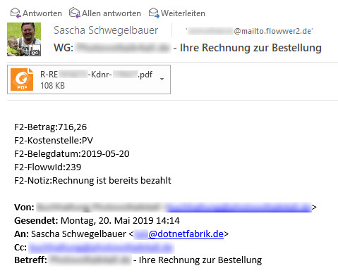
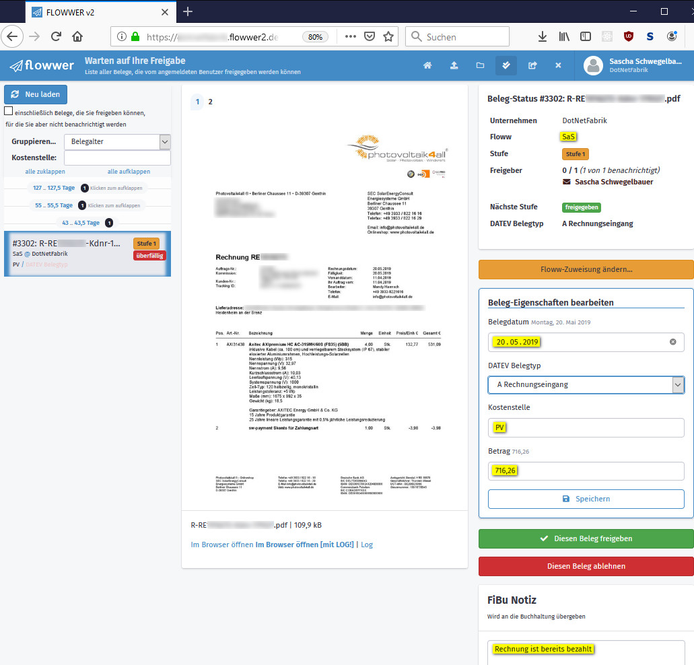

>>>>> Begriffe, die **{c:blue}BLAU{/c}** geschrieben sind, müssen durch Echtdaten Ihrer FLOWWER2-Umgebung ersetzt werden.  
>>>>> Die maximale Nachrichtengröße beträgt 5 MB.

Über die Schnittstelle **MailToFlowwer** können Sie Belege per E-Mail direkt in Ihr FLOWWER2-Konto übertragen.  
Jeder Mailanhang im .pdf-Format wird von MailToFlowwer automatisch in einen Beleg umgewandelt.  
Schicken Sie einfach eine Mail an {c:blue}IHRE-KONTONUMMER{/c}@mailto.flowwer2.de (weiterleiten geht natürlich auch)  

>>> {c:blue}IHRE-KONTONUMMER{/c} entspricht der Nummer (ohne https://), die im Browser links von .flowwer2.de in der Adressleiste steht, wenn Sie auf Ihr Konto zugreifen.  
>>> Beispiel: Für das Flowwer-Konto https://{c:blue}2099999{/c}.flowwer2.de wäre die MailToFlowwer-Zieladresse {c:blue}2099999{/c}@mailto.flowwer2.de

Weitere Merkmale sind:

* Absenderprüfung: die Absendeadresse muss einem **aktiven** Benutzer im Zielkonto gehören und der Benutzer muss die Berechtigung zum Hochladen besitzen
* Flowws direkt zuweisen (über den Floww-Namen oder die Floww-Id - das Benutzerrecht "Belege zuweisen" ist **nicht** notwendig)
* Kostenstelle zuweisen
* Einen Fibu-Kommentar anfügen
* Das Rechnungsdatum und den Betrag setzen

>>>>> Das kostenpflichtige Markplatz-Feature "MailToFlowwer" muss aktiviert sein

## Zuweisung zu einem Floww
Sie können die aus der E-Mail erzeugten Belege direkt einem Floww zuweisen:

* über die Zieladresse: {c:blue}IHRE-KONTONUMMER{/c}+{c:blue}FLOWWID{/c}@mailto.flowwer2.de für die Zuweisung über die ID des Flowws
* über den Nachrichtentext (siehe nachfolgender Abschnitt)

### Steuerungsmöglichkeiten über den Nachrichtentext
MailToFlowwer durchsucht den Text der E-Mail und erkennt "Variablen", welche in folgendem Format vorliegen müssen:

    F2-VARIABLE = Zuzuweisender Wert
    oder
    F2-VARIABLE : Zuzuweisender Wert

#### Mögliche Variablen

**Belegdatum, Datum, Date** setzt das Belegdatum in FLOWWER2. Wird kein Wert übergeben, setzt MailToFlowwer das aktuelle Tagesdatum.

**Brutto, Total, Betrag** setzt den Betrag des Belegs

**Belegtyp, Documenttype** weist den DATEV-Belegtyp zu. Wird kein Wert übergeben, wird "Rechnungseingang" gesetzt.

**Flow, Floww, FlowId, FlowwId** sucht den Floww mit der übergebenen ID und weist den Beleg zu

**FlowName, FlowwName** weist den Beleg dem als erstes gefundenen Floww mit dem übergebenen Namen zu.

**Kommentar / Comment / Notiz / Notice** setzt die FiBu-Notiz auf diesen Wert

**Kostenstelle, CostCenter** weist die Kostenstelle zu

**AntiSpam**
Reserviert für zukünftige Zwecke

**Faellig, Fällig, Due**
Reserviert für zukünftige Zwecke

**Kreditor / Creditor** 
Reserviert für zukünftige Zwecke

#### Beispiel

    F2-Betrag:716,26                       (Wert des Datenfelds "Betrag" setzen)
    F2-Kostenstelle:PV                     (Kostenstelle auf "PV" setzen)
    F2-Belegdatum:2019-05-20               (Belegdatum setzen)
    F2-FlowwId:239                         (Das Dokument wird dem Floww mit der ID '239' zugewiesen)
    F2-Notiz:Rechnung ist bereits bezahlt  (Text in FiBu-Notiz)

